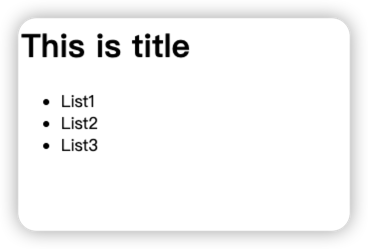
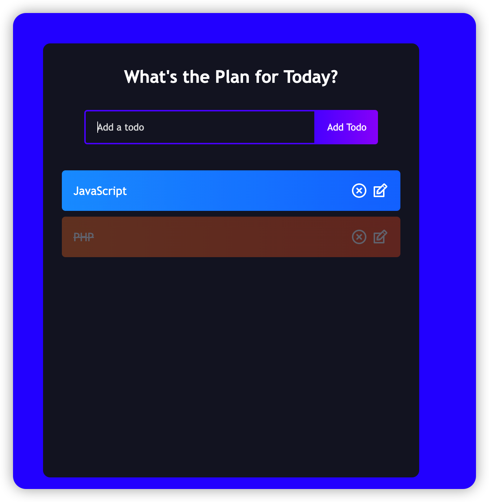

# REACT Simple
- Create Project:

```js
yarn create react-app my-app --template typescript
```

## Html Website 


```html
 <div name="section1">
        <h1>This is title</h1>
    </div>
  
    <div name="section2">
        <ul>
            <li>List1</li>
            <li>List2</li>
            <li>List3</li>
        </ul>
    </div>
```

## React Way

- Composable
- Component

## Composity Thoughts

- Two Section
- Compose these two sections
  
How to:
1. Build Section
```js
import React from "react";

export class SimpleH extends React.Component{
    
    render(){
        return (
            <div id="section1">
                <h1>This is title</h1>
            </div>  
        )
    }
}
```

```js
import React from "react";

export class ShoppingList extends React.Component {
    render() {
        return (
            <div id = "shoppinglist">
                <h1>Shopping List</h1>
                 <ul>
                    <li>L1</li>
                    <li>L2</li>
                    <li>L3</li>
                 </ul>
            </div>
        )
    }
}
```

## Combine/Composite These Components

```ts
import React from 'react';
import './App.css';
import { ShoppingList } from './compoents/demo/ShoppingList';
import { SimpleH } from './compoents/demo/SimpleH';
import TodoList from './compoents/todo/TodoList';

const App: React.FC = () => {
  return (
    <><div>
      <SimpleH />
      <ShoppingList />
    </div><div className="todo-app">
        <TodoList />
      </div></>

  );
}

export default App;
```

## To Do App



Sections:
1. TodoList: all 
2. TodoForm: input todo and add it
3. TodoItem: Listed Item, Delete and edit item

