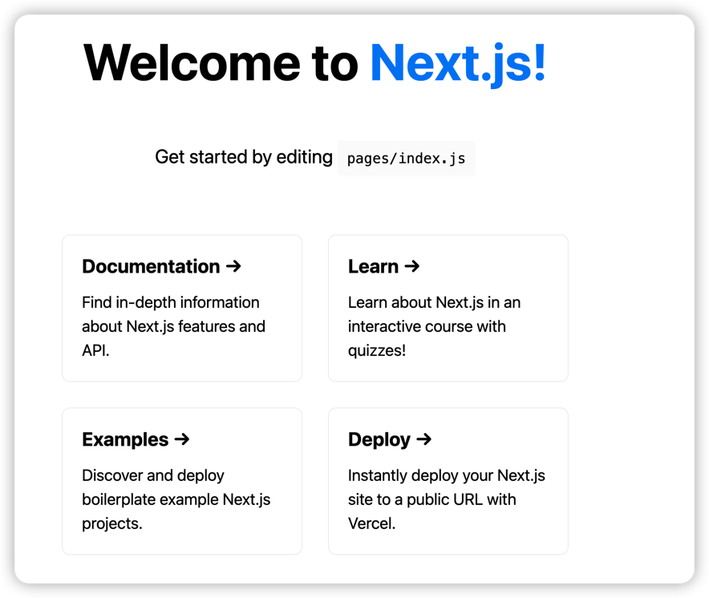
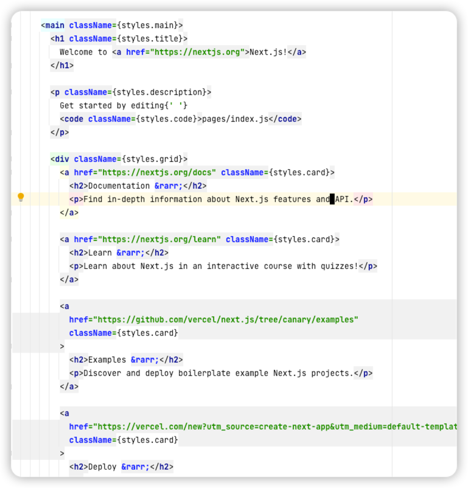
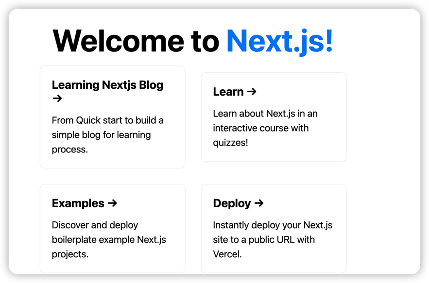

# Nextjs APP

## Overview

- Page-Based
- Dynamic Router
- Pre-Rending:static generation/server-side rending
- Client-side routing
- Build-in CSS/Saas/Css-in-JS
- Fast Refresh
- API Router

## create and setup

```shell
npx create-next-app nextjs-blog
npx create-next-app nextjs-blog --use-npm --example "https://github.com/vercel/next-learn/tree/master/basics/learn-starter"
```

## Demo Layout




